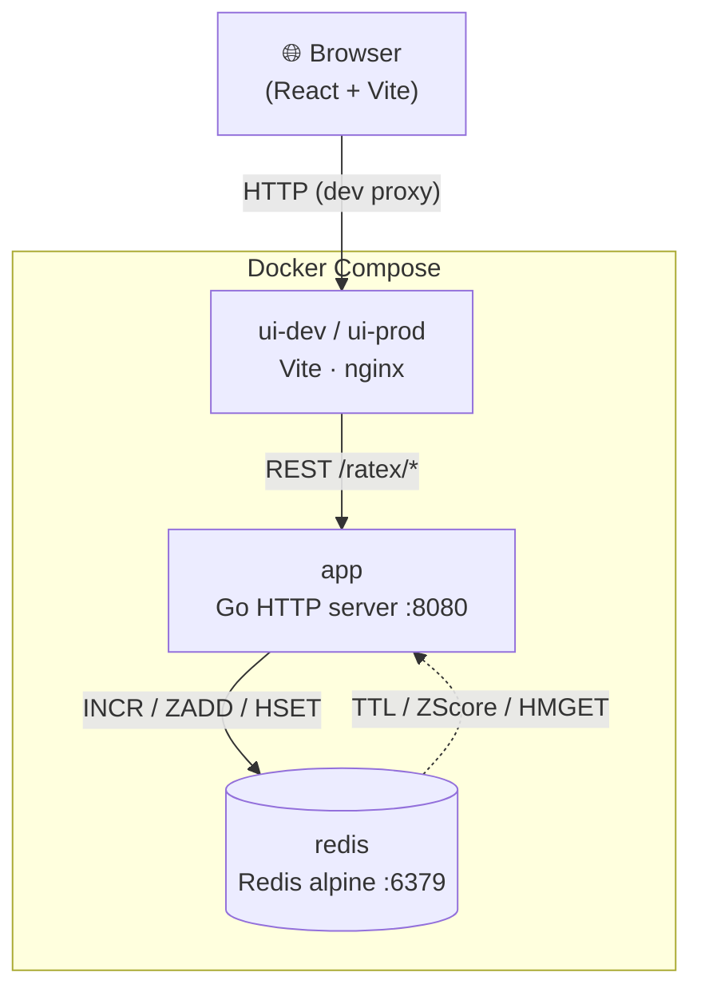
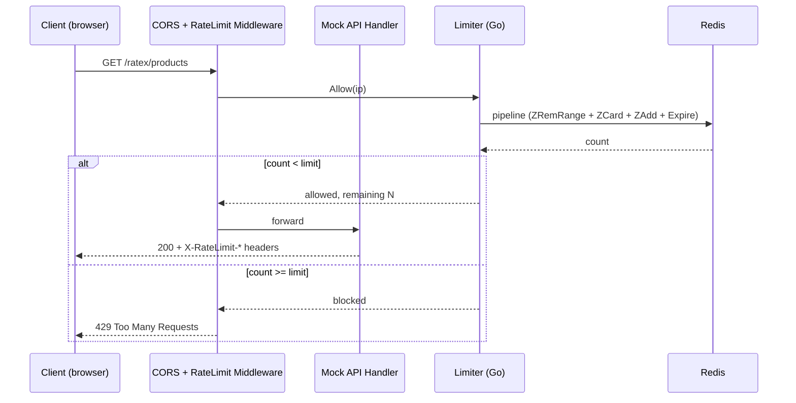
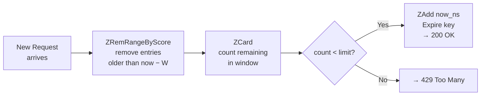
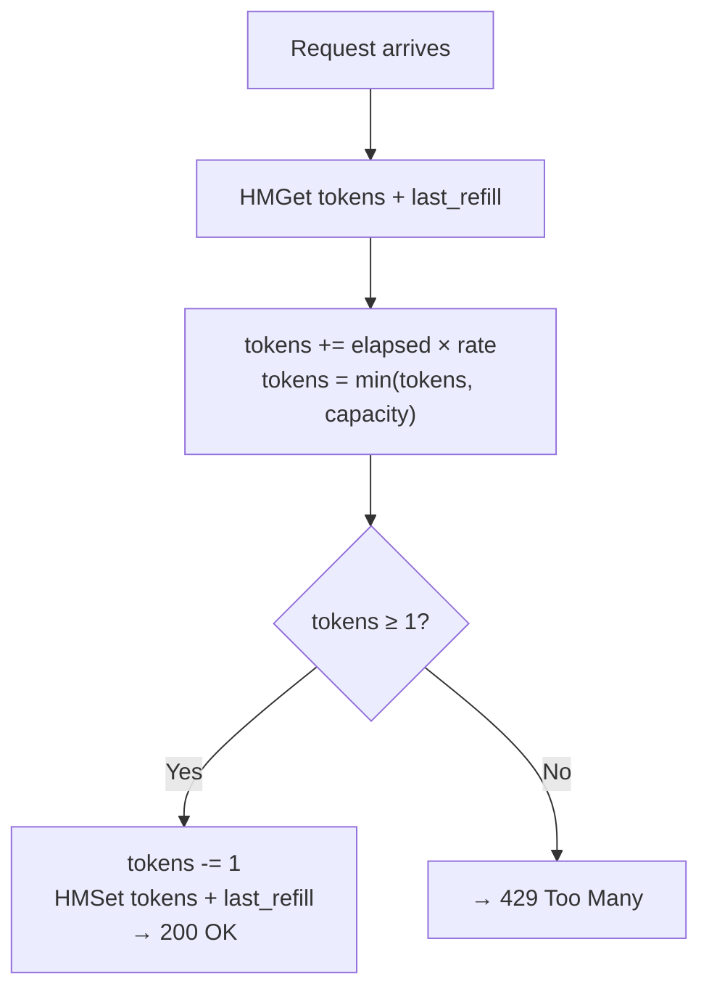
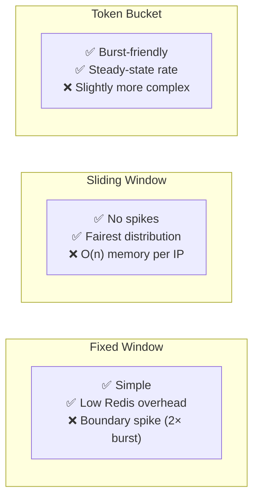
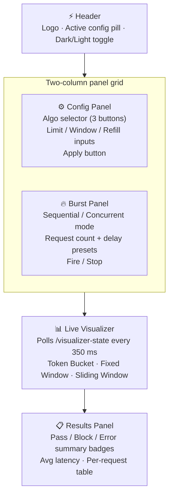
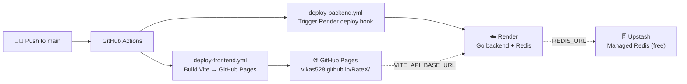

# ⚡ RateX — Redis-Powered Rate Limiter Playground

[](https://github.com/vikas528/RateX/actions/workflows/deploy-frontend.yml)
[](https://github.com/vikas528/RateX/actions/workflows/ddeploy-fly-io-backend.yml)
[](https://github.com/vikas528/RateX/actions/workflows/ddeploy-render-backend.yml)
[](LICENSE)

> An interactive, full-stack rate-limiter playground that lets you configure, stress-test, and **watch in real time** three classic rate-limiting algorithms — all backed by Redis.

---

## 📺 Live Demo

| Environment | URL |
|-------------|-----|
| 🌐 Frontend (GitHub Pages) | https://vikas528.github.io/RateX/ |
| 🔌 Backend API (Render) | https://ratex-backend.onrender.com |
| 🐳 Local Docker | `http://localhost:5173` (dev) · `http://localhost:3000` (prod) |

---

## ✨ Features

| Feature | Details |
|---------|---------|
| 🔀 **3 algorithms** | Fixed Window · Sliding Window · Token Bucket |
| 🔴 **Live visualizer** | Polls every 350 ms; shows animated bucket fill, dual-ring timer, or scrolling timeline |
| ⚡ **Burst testing** | Sequential (with optional delay) or truly-concurrent (all promises fire simultaneously) |
| 🔧 **Hot config reload** | Swap algorithm, limit, and window at runtime; Redis keys flushed automatically |
| 🌗 **Dark / light theme** | Persistent preference saved in `localStorage` |
| 📊 **Results table** | Per-request status, remaining quota, reset time, and latency |
| 🐳 **Docker-first** | Single `docker compose up --build` spins up Redis + backend + frontend |

---

## 🏗 Architecture



### Request lifecycle



---

## 🧠 Algorithm Deep-Dive

### 1 · Fixed Window

Requests are counted inside a **hard time bucket** aligned to the clock.
The counter resets sharply at the bucket boundary — which can allow **2× the limit** across a window edge.

```mermaid
gantt
    dateFormat  s
    axisFormat  %Ss

    section Window 1  (0 – 60 s)
    Requests 1–100 allowed   :done, 0, 30s
    Window resets            :milestone, 60, 0

    section Window 2  (60 – 120 s)
    Requests 101–200 allowed :done, 60, 90s
```



**Redis key:** `fw:<ip>:<bucket_epoch>`
**Commands:** `INCR` + `EXPIRE`

---

### 2 · Sliding Window

A **sorted set** stores every request's Unix-nanosecond timestamp as both score and member.
On each request, entries older than `window_seconds` are removed **before** counting.
No boundary spikes — the smoothest and fairest of the three algorithms.



**Redis key:** `sw:<ip>`
**Commands:** `ZREMRANGEBYSCORE` · `ZCARD` · `ZADD` · `EXPIRE` (pipelined)

---

### 3 · Token Bucket

Tokens refill at a configurable **rate (tokens/sec)** up to a **capacity**.
Short bursts up to capacity are allowed; sustained traffic is bounded by the refill rate.



**Redis key:** `tb:<ip>`
**Commands:** `HMGET` · `HMSET`

---

### Algorithm Comparison



---

## 🗂 Project Structure

```
RateX/
├── backend/
│   ├── main.go                  # HTTP server wiring
│   ├── common/builder.go        # Limiter factory (selects algo from config)
│   ├── config/
│   │   ├── app_config.go        # AppConfig struct + env loader
│   │   └── server.go            # Server singleton (limiter hot-swap, RWMutex)
│   ├── constants/
│   │   ├── env.go               # Env-var names + compile-time defaults
│   │   ├── errors.go            # All error message strings
│   │   └── routes.go            # Every API route path (single source of truth)
│   ├── limiter/
│   │   ├── limiter.go           # RateLimiter interface
│   │   ├── fixed_window.go      # Fixed-window Redis implementation
│   │   ├── sliding_window.go    # Sliding-window Redis implementation
│   │   └── token_bucket.go      # Token-bucket Redis implementation
│   ├── middleware/
│   │   ├── cors_middleware.go   # CORS handler (allows browser requests)
│   │   └── middleware.go        # RateLimit middleware + X-RateLimit-* headers
│   ├── mock/
│   │   ├── mock_api_handler.go  # Products / Orders / Users / Config / Root
│   │   └── mock_data.go         # In-memory product catalogue
│   ├── utils/utils.go           # JSON writer, env parsers (EnvOr / Int / Float)
│   ├── visualizer/visualizer.go # /ratex/visualizer-state — per-algo snapshots
│   ├── go.mod
│   └── Dockerfile               # Multi-stage: build → scratch image
│
├── frontend/
│   ├── src/
│   │   ├── App.jsx              # Root — theme state management + layout
│   │   ├── main.jsx             # React entry point, CSS import chain
│   │   ├── App.css              # CSS barrel (@import from styles/)
│   │   ├── constants/
│   │   │   ├── algorithms.js    # ALGOS enum, labels, descriptions
│   │   │   ├── api.js           # Route paths + BURST_ENDPOINTS array
│   │   │   └── ui.js            # Poll interval, display limits, messages
│   │   ├── hooks/
│   │   │   ├── useRateLimiterConfig.js  # GET + POST /ratex/config
│   │   │   └── useBurst.js              # Concurrent / sequential burst runner
│   │   ├── components/
│   │   │   ├── Header/          # Logo + active-config pill + theme toggle button
│   │   │   ├── ConfigPanel/     # Algo selector grid + inputs + Apply button
│   │   │   ├── BurstPanel/      # Mode toggle, count presets, fire/stop buttons
│   │   │   ├── ResultsPanel/    # Pass/block/err badges + results table
│   │   │   └── visualizer/
│   │   │       ├── VisualizerCard.jsx   # Polling wrapper (useEffect + setInterval)
│   │   │       ├── FixedWindowViz.jsx   # Dual-ring SVG (outer=time, inner=usage)
│   │   │       ├── SlidingWindowViz.jsx # Scrolling timeline SVG + age bars
│   │   │       ├── TokenBucketViz.jsx   # Animated liquid bucket + drop animation
│   │   │       ├── StatCard.jsx         # Reusable metric tile component
│   │   │       └── colorHelpers.js      # usageColor (FW/SW) + levelColor (TB)
│   │   └── styles/
│   │       ├── theme.css        # Design tokens: dark + light (CSS custom props)
│   │       ├── layout.css       # Body, header, card shells, theme-toggle button
│   │       ├── forms.css        # Inputs, algo selector, burst controls, chips
│   │       ├── results.css      # Results table, badges, progress bar, spinner
│   │       └── visualizer.css   # All visualizer-specific styles + animations
│   ├── vite.config.js           # Dev-server proxy → Go backend at :8080
│   ├── Dockerfile               # Multi-stage: node build → nginx serve
│   └── Dockerfile.dev           # Vite dev server (volume-mounted src)
│
├── docker-compose.yaml          # redis + app + ui-dev (local) / ui-prod
├── .env.example                 # Template — copy to .env
└── README.md
```

---

## 🚀 Quick Start

### Prerequisites

| Tool | Version |
|------|---------|
| Docker | 24+ |
| Docker Compose v2 | bundled with Docker Desktop |
| Go | 1.22+ _(local dev only)_ |
| Node.js | 20+ _(local dev only)_ |

### 1 · Clone & configure

```bash
git clone https://github.com/<your-username>/RateX.git
cd RateX
cp .env.example .env      # edit as needed
```

### 2 · Start with Docker (recommended)

```bash
# Development mode — Vite hot-reload, source volume-mounted
docker compose up --build

# Production mode — nginx + optimised static build
# Edit .env → COMPOSE_PROFILES=production
docker compose up --build
```

| Service | URL |
|---------|-----|
| Frontend (dev) | http://localhost:5173 |
| Frontend (prod) | http://localhost:3000 |
| Backend API | http://localhost:8080 |
| Redis | localhost:6379 |

### 3 · Local development (no Docker)

```bash
# Terminal 1 – Redis
docker run -p 6379:6379 redis:alpine

# Terminal 2 – Backend
cd backend
RATE_LIMITER_ALGO=sliding_window RATE_LIMITER_LIMIT=20 go run main.go

# Terminal 3 – Frontend
cd frontend
npm install
npm run dev
# Set VITE_API_BASE_URL=http://localhost:8080 in frontend/.env.local
```

---

## ⚙️ Configuration Reference

| Variable | Default | Description |
|----------|---------|-------------|
| `COMPOSE_PROFILES` | `local` | `local` = Vite dev · `production` = nginx |
| `REDIS_ADDR` | `redis:6379` | Redis address (`localhost:6379` outside Docker) |
| `BACKEND_PORT` | `8080` | Exposed backend port |
| `RATE_LIMITER_ALGO` | `sliding_window` | `fixed_window` · `sliding_window` · `token_bucket` |
| `RATE_LIMITER_LIMIT` | `100` | Max requests per window / bucket capacity |
| `RATE_LIMITER_WINDOW_SECS` | `60` | Window size in seconds (Fixed + Sliding only) |
| `RATE_LIMITER_REFILL_RATE` | `1.0` | Tokens/second refill rate (Token Bucket only) |
| `FRONTEND_DEV_PORT` | `5173` | Vite dev-server host port |
| `FRONTEND_PROD_PORT` | `3000` | nginx host port |

> Config can also be **hot-swapped at runtime** via the UI Config Panel — Redis keys are flushed automatically so the new limits take effect immediately.

---

## 📡 API Reference

All endpoints are prefixed with `/ratex`.

### Non-rate-limited

| Method | Path | Description |
|--------|------|-------------|
| `GET` | `/ratex/health` | Liveness probe → `{ "status": "ok" }` |
| `GET` | `/ratex/visualizer-state` | Current limiter snapshot (polled by UI every 350 ms) |
| `GET` | `/ratex/config` | Active algorithm configuration |
| `POST` | `/ratex/config` | Hot-swap config `{ algo, limit, window_seconds, refill_rate }` |

### Rate-limited (return `X-RateLimit-*` headers)

| Method | Path | Description |
|--------|------|-------------|
| `GET` | `/ratex/products` | List all products (optional `?category=electronics`) |
| `GET` | `/ratex/products/{id}` | Single product by integer ID |
| `POST` | `/ratex/orders` | Create order `{ product_id, quantity }` |
| `GET` | `/ratex/users/me` | Mock authenticated user profile |

**Rate-limit response headers:**

```
X-RateLimit-Remaining: 42
X-RateLimit-Reset:     1712503200
```

**429 body:**

```json
{ "error": "rate limit exceeded" }
```

### Visualizer state payload examples

<details>
<summary>Token Bucket</summary>

```json
{
  "algo": "token_bucket",
  "limit": 100,
  "capacity": 100,
  "tokens": 87.34,
  "refill_rate": 1.5,
  "percent_full": 87.3
}
```
</details>

<details>
<summary>Fixed Window</summary>

```json
{
  "algo": "fixed_window",
  "limit": 100,
  "count": 23,
  "ttl_ms": 44200,
  "window_ms": 60000,
  "percent_used": 23.0
}
```
</details>

<details>
<summary>Sliding Window</summary>

```json
{
  "algo": "sliding_window",
  "limit": 100,
  "count": 15,
  "window_seconds": 60,
  "request_ages_ms": [120.3, 980.7, 2400.1],
  "percent_used": 15.0
}
```
</details>

---

## 🎨 UI Walkthrough



### Visualizer colour semantics

The colour ramp changes meaning depending on the algorithm:

| Visualizer | 🟢 Green = | 🟡 Orange = | 🔴 Red = |
|-----------|-----------|------------|---------|
| **Fixed Window** | Low usage (lots of quota left) | Approaching limit | At or over limit |
| **Sliding Window** | Low usage (lots of quota left) | Approaching limit | At or over limit |
| **Token Bucket** | Bucket full (plenty of tokens) | Partial fill | Bucket empty (will rate-limit) |

---

## 🛠 Tech Stack

| Layer | Technology |
|-------|-----------|
| Language (BE) | Go 1.22 |
| HTTP routing | `net/http` stdlib `ServeMux` |
| Redis client | `github.com/redis/go-redis/v9` |
| Language (FE) | React 18 + Vite 5 |
| Styling | Plain CSS custom properties (no CSS framework) |
| Container runtime | Docker + Docker Compose v2 |
| Production web server | nginx |

---

## 🚢 Deployment (GitHub Actions + Render)

This repo ships two GitHub Actions workflows that deploy automatically on every merge to `main`.



### Step-by-step setup guide

#### 1 · GitHub repository settings

Go to **Settings → Pages** and set **Source = "GitHub Actions"**.

#### 2 · Get a free Redis URL from Upstash (no credit card required)

1. Go to [console.upstash.com](https://console.upstash.com) → **Create Database**.
2. Choose a region close to your Render service (e.g. `us-east-1`).
3. Copy the **Redis URL** — it looks like `rediss://default:<password>@<host>.upstash.io:<port>`.

#### 3 · Deploy the backend to Render

1. Sign up at [render.com](https://render.com) and click **New → Blueprint Instance**.
2. Connect your `vikas528/RateX` GitHub repo — Render reads `render.yaml` automatically and creates `ratex-backend`.
3. When prompted for the `REDIS_URL` secret, paste the Upstash URL from step above.
4. After the first deploy, copy the service URL (e.g. `https://ratex-backend.onrender.com`).
5. Go to Render dashboard → **ratex-backend → Settings → Deploy Hook** → copy the full hook URL.

#### 3 · Add GitHub secrets & variables

Go to **Settings → Secrets and variables → Actions** in your GitHub repo.

**Secrets** (encrypted, never shown again):

| Name | Where to find it | Used by |
|------|-----------------|---------|
| `RENDER_DEPLOY_HOOK_URL` | Render dashboard → ratex-backend → Settings → Deploy Hook | `deploy-backend.yml` |

**Variables** (plain text, visible):

| Name | Value | Used by |
|------|-------|---------|
| `VITE_API_BASE_URL` | `https://ratex-backend.onrender.com` (your Render URL from step 4) | `deploy-frontend.yml` |

#### 5 · Enable GitHub Pages (one-time)

Go to repo → **Settings → Pages → Source = "GitHub Actions"**.

#### 6 · Add CORS origin for GitHub Pages (optional but recommended)

If the browser blocks cross-origin requests from GitHub Pages to Render, add your Pages URL to the CORS allow-list in `backend/middleware/cors_middleware.go`.

If the browser blocks cross-origin requests from GitHub Pages to Render, add your Pages URL to the CORS allow-list in `backend/middleware/cors_middleware.go`.

#### Workflow overview

| Workflow | File | Trigger | What it does |
|----------|------|---------|-------------|
| Deploy Frontend | `.github/workflows/deploy-frontend.yml` | Push to `main` | `npm ci` → `npm run build` (with `VITE_BASE_PATH=/RateX/`) → upload to GitHub Pages |
| Deploy Backend | `.github/workflows/deploy-backend.yml` | Push to `main` (backend/ or render.yaml changed) | POST to `RENDER_DEPLOY_HOOK_URL` → Render rebuilds Docker image |

---

## 🤝 Contributing

1. Fork and create a feature branch: `git checkout -b feat/my-feature`.
2. Run the project with `docker compose up --build`.
3. **Backend:** `go vet ./...` and `go test ./...` before committing.
4. **Frontend:** `npm run lint` inside `frontend/`.
5. Open a pull request — describe _what_ changed and _why_.

---

## 📄 License

MIT © 2026 — see [LICENSE](LICENSE) for details.
